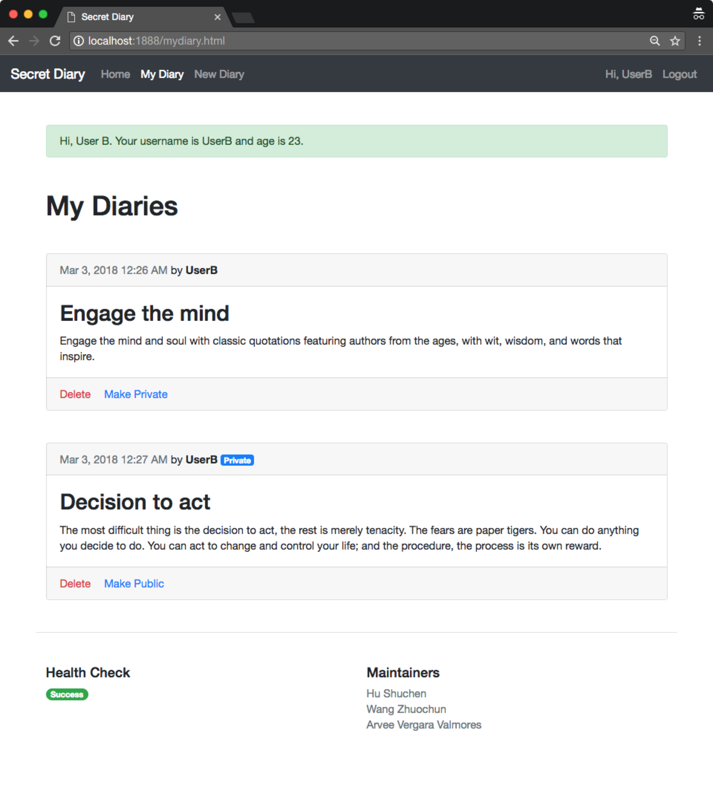

# rest-api-development

CS5331 Assignment 1 Project Reference Repository

## Instructions

Your objective is to implement a web application that provides the endpoints
specified here: https://cs5331-assignments.github.io/rest-api-development/.

The project has been packaged in an easy to set-up docker container with the
skeleton code implemented in Python Flask. You are not restricted in terms of
which language, web stack, or database you desire to use. However, please note
that very limited support can be given to those who decide to veer off the
beaten path.

You may be required to modify the following files/directories:

- Dockerfile - contains the environment setup scripts to ensure a homogenous
  development environment
- src/ - contains the front-end code in `html` and the skeleton Flask API code
  in `service`
- img/ - contains images used for this README

Assuming you're developing on an Ubuntu 16.04 machine, the quick instructions
to get up and running are:

```
# Install Docker

sudo apt-get update
sudo apt-get install \
    apt-transport-https \
    ca-certificates \
    curl \
    software-properties-common
curl -fsSL https://download.docker.com/linux/ubuntu/gpg | sudo apt-key add -
sudo add-apt-repository \
   "deb [arch=amd64] https://download.docker.com/linux/ubuntu \
   $(lsb_release -cs) \
   stable"
sudo apt-get update
sudo apt-get install docker-ce

# Verify Docker Works

sudo docker run hello-world

# Run the skeleton implementation

sudo ./run.sh
```

(Docker CE installation instructions are from this
[link](https://docs.docker.com/install/linux/docker-ce/ubuntu/#install-using-the-repository).)

**Please consult your assignment hand-out for detailed setup information.**

## Grading

The implementation will be graded in an automated fashion on an Ubuntu 16.04
virtual machine by building the docker container found in your repository and
running it. The grading script will interact with your API.

The following ports are expected to be accessible:

1. 80, on which static HTML content, including the front-end, is served.
2. 8080, on which the API is exposed.

To verify this, please run the following commands:

```
sudo ./run.sh
```

On a different window:

```
curl http://localhost:80
curl http://localhost:8080
```

If a response is received, you're good to go.

**Please replace the details below with information relevant to your team.**

## Screenshots

Please replace the example screenshots with screenshots of your completed
project. Feel free to include more than one.



## Administration and Evaluation

Please fill out this section with details relevant to your team.

### Team Members (Group 5)

1. Member 1 Hu Shuchen
2. Member 2 Wang Zhuochun
3. Member 3 Arvee Vergara Valmores

### Short Answer Questions

#### Question 1: Briefly describe the web technology stack used in your implementation.

Answer: We have used Flask web framework, MySQL for database schema, Vue.js for front-end development.

#### Question 2: Are there any security considerations your team thought about?

Answer: We have enforced user password strength with minimum length of 8 characters, containing both small and capitals letters as well as at one number. We have also implemented account lockout policy where the user account will be locked for 1 hour after 3 failed login attempts.
As we are using MySQL for our database, we have also made use of the mature library SQLAlchemy, and utilized prepared statements in the backend codes to enforce our protection against SQL injection attacks.

#### Question 3: Are there any improvements you would make to the API specification to improve the security of the web application?

Answer: - Enforce authentication token expiry for certain duration or inactivity. This can reduce the risk of stolen tokens through XSS or other types of attacks.
        - Allow password reset or change of password with security measures
        - Implement 2-factor or multi-factor user authentication
        - Implement HTTPS to encrypt JSON requests and responses over the network

#### Question 4: Are there any additional features you would like to highlight?

Answer: Not other than the password strength and account lockout policy. Password requirements are shown in the user interface as well when users try to set their passwords.

#### Question 5: Is your web application vulnerable? If yes, how and why? If not, what measures did you take to secure it?

Answer: We did not find our application vulnerable. In our development, we have made sure to use of mature libraries with functions to render user inputs like their diaries just as text rather than scripts. We have tested possibilities of cross-site scripting as shown in the screenshot below and our application is not vulnerable to those.


#### Feedback: Is there any other feedback you would like to give?

Answer: No.

### Declaration

#### Please declare your individual contributions to the assignment:

1. Member 1 Hu Shuchen
    - Wrote the front-end code and integrated with the API features developed by teammates
    - Tested and checked the work done by teammates
    - Logistics (set up Github organization, short answer questions)
2. Member 2 Wang Zhuochun
    - Developed the Users API
    - Designed the database schema for Users
    - Tested and checked the work done by teammates
3. Member 3 Arvee Vergara Valmores
    - Developed the Diary API
    - Designed the database schema for Diary entries
    - Tested and checked the work done by teammates

